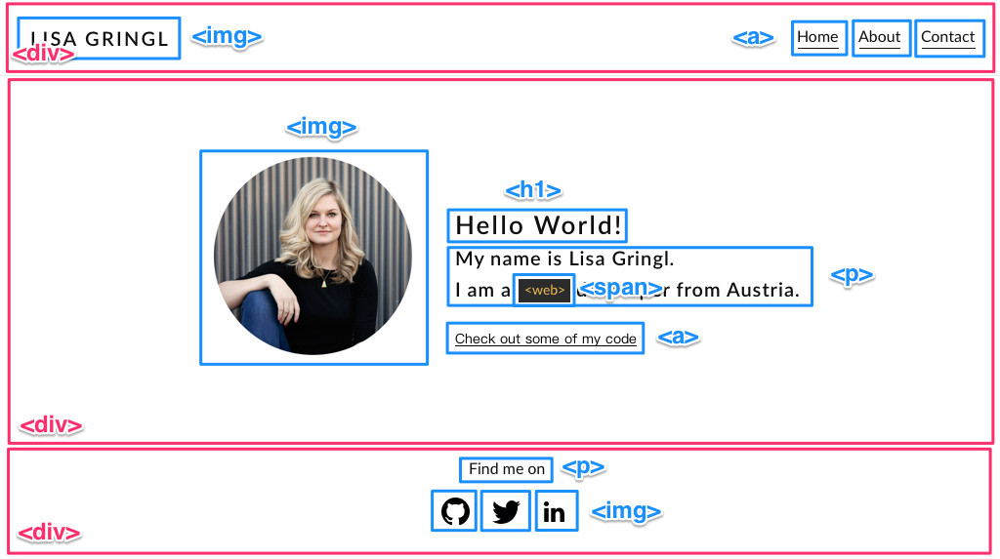
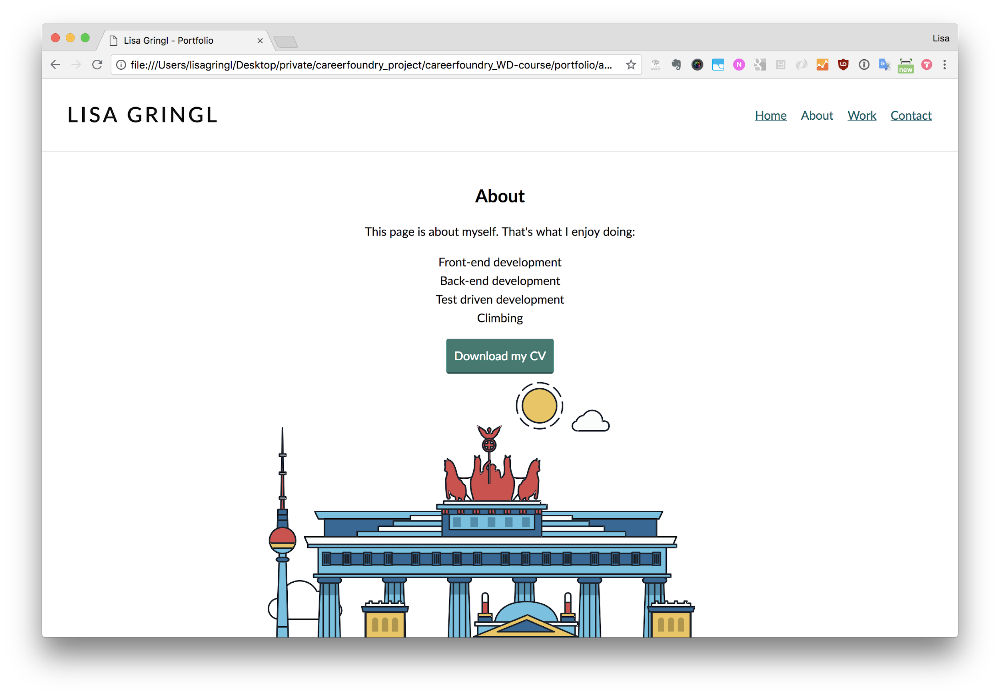

# Portfolio Website

### What is this about?

This portfolio website was built as a task in [Career Foundry's Full-Stack Web Development Program](https://careerfoundry.com/en/courses/become-a-web-developer/), during the "Intro to Frontend Development" section.

[Click here to jump to the bottom to see screenshots](#Screenshots)

### Provided upfront

- Berlin `<svg>`
- `index.html`, according to the delivered, annotated HTML template: 
- `about.html`, according to the delivered template: 

### Project requirements

- desktop first, responsive (I changed this to mobile first (starting at 320px))
- HTML, CSS (no SCSS)
- no JavaScript, besides [tota11y](https://khan.github.io/tota11y/)
- no build workflow
- use of one external CSS file, with either CSS variables or a CSS preprocessor
- code must be valid (Markup Validation Service, WebAIM Contrast Checker)
- must consist of at least 3 interconnected HTML pages
  - home (index) page with short introduction and link(s) to work examples
  - about page with key information about me as an individual, relevant skills, tools or programming language(s)
  - work page (or section) with work examples, displayed as "cards" in a grid
  - contact page (or section) with `<form>` element, form validation, proper `<label>` and `<input>`, basic contact details
- must be hosted on GitHub, and here GitHub pages (with dedicated `gh-pages` branch)

### Languages, Libraries, Frameworks

- HTML
- CSS
- tota11y

### Sources

- [Markup Validation Service](https://validator.w3.org/)
- [WebAIM Contrast Checker](https://webaim.org/resources/contrastchecker/)
- [tota11y on GitHub, explicitly version 0.1.6](https://github.com/Khan/tota11y/releases/tag/0.1.6)

### Tools, Extensions

- Visual Studio Code
- GitHub / [Portfolio Website on GitHub Pages](https://ellypirelly.github.io/cf-portfolio-website/)
- [tota11y on GitHub, explicitly version 0.1.6](https://github.com/Khan/tota11y/releases/tag/0.1.6), grab zip folder to use the `min.js` that's in the `build` folder
  - during the final assignment I took that script off to not have it present on live GitHub Pages sites
- [PostCSS CSS Variables](https://madlittlemods.github.io/postcss-css-variables/playground/) to compile CSS Variables to "simple" CSS
- [Autoprefixer](http://autoprefixer.github.io/) to set the exact browser versions to support and add all needed prefixes

### How to run this?

As there's no npm packages or a build workflow present, it's fairly easy:

- clone the repo
- `cd` into project
- if on Visual Studio Code, install "Live Server" extension, go to bottom menu and click "Go Live":  
    
- this is going to open the website on localhost http://127.0.0.1:5500/

Note to self: possible TODO:

### Screenshots

TODO
